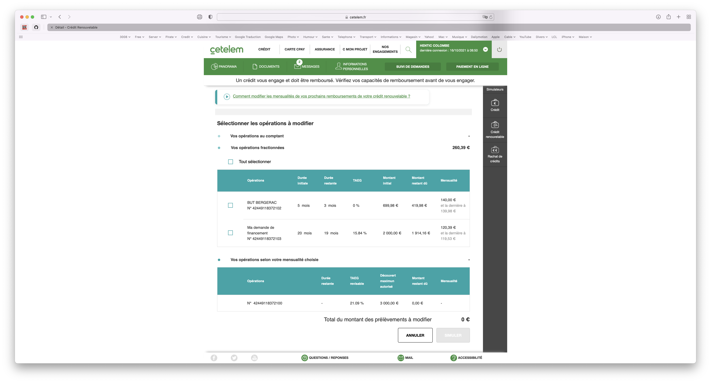
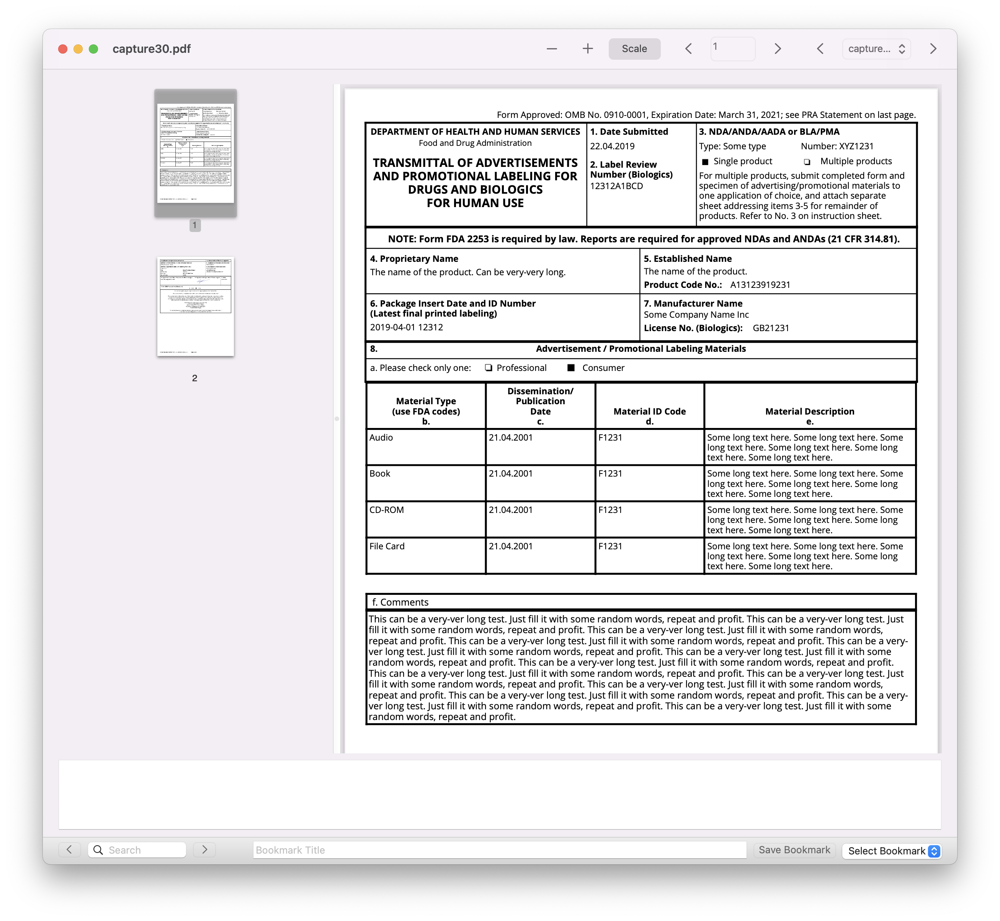
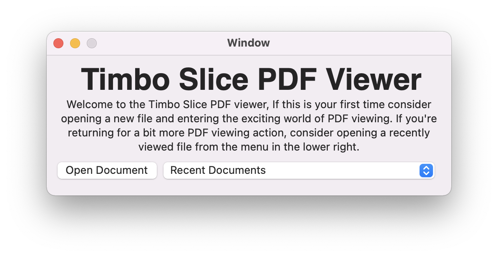

    
    
    

<em>presentation</em> 

<em>page 1</em> 

<em>page 2</em> 

# OSX-PDF-Viewer

A PDF viewer created for a 3rd year Computer Science project. A Cocoa application created using Swift and the PDFkit provided by the Quartz framework. Created by Patrick Skinner and Cassidy Mowat.

•	Navigation through a PDF document, back/forward and to a given page

•	Can open and navigate through multiple documents

•	Title bar updates based on current PDF name

•	Can zoom in, out and scale the document to the window

•	Can record brief notes about a page. These are stored persistently

•	Can bookmark pages in a document with a custom name for easy identification. These are stored persistently.

•	Custom menu structure is provided

•	A start up screen is displayed, allowing users to select from a persistent list of recently opened documents or open a new document.

•	Document search is provided, highlights every instant of the search term in the document, then can traverse backwards and forward between instances.

•	A PDF thumbnail view is included, allow users to easily find a certain page in the document
